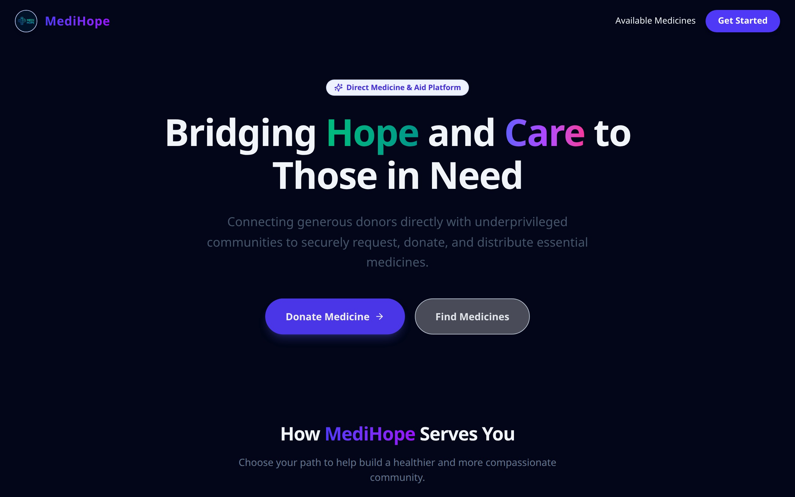
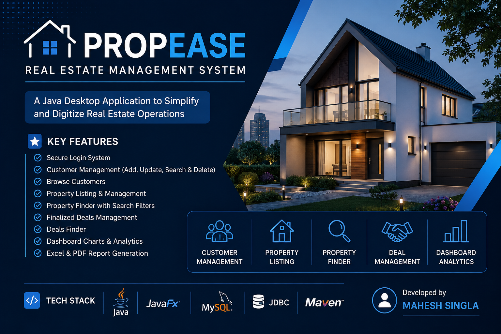
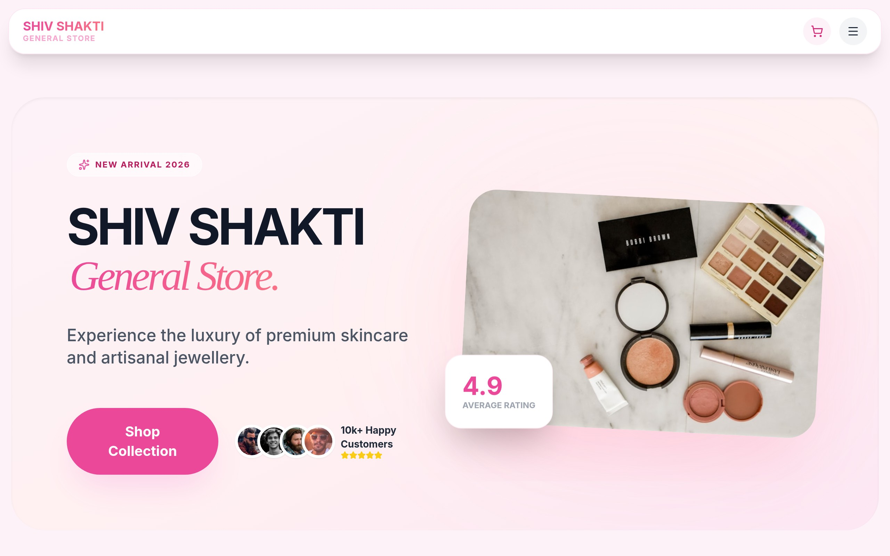

# Mahesh Singla – Developer Portfolio 🎨

[](https://vitejs.dev/)
[](https://reactjs.org/)
[](https://tailwindcss.com/)
[](https://www.framer.com/motion/)
[](https://opensource.org/licenses/MIT)

---

## 👋 Overview

A **production‑ready, premium‑looking personal developer portfolio** built for **Mahesh Singla**. The design follows a “late‑night build session” aesthetic – dark, glass‑morphism‑styled, high‑contrast amber highlights, and smooth micro‑animations. All content (projects, skills, contacts) is **data‑driven** via `src/data/*.js` files, making it trivial to extend.

💡 **Why this repo?**
- Showcases real projects with **live screenshots** (MediHope & Shiv Shakti). 
- Includes a **downloadable resume** button.
- Fully responsive, keyboard‑navigable, and respects `prefers-reduced-motion`.
- Ready to deploy on Vercel, Netlify, or GitHub Pages with a single `npm run build`.

---

## 🚀 Live Demo

- **Portfolio:** https://mahesh-singla-portfolio.vercel.app/
- **MediHope:** https://medihope.vercel.app/
- **Shiv Shakti (SSGS):** https://ssgs-delta.vercel.app/

---

## 🛠️ Tech Stack

| Category | Technologies |
|----------|---------------|
| **Core** | React 18, Vite 5, JavaScript (ES2023) |
| **Styling** | Tailwind CSS 3 (custom design tokens), Google Fonts **Space Grotesk**, **Inter**, **JetBrains Mono** |
| **Animations** | Framer Motion (with `useReducedMotion` support) |
| **Routing** | React Router v6 (single‑page navigation) |
| **Icons** | `react-icons/fi` (Feather), custom SVG assets |
| **Build & Deploy** | Vite, TypeScript‑optional, Vercel (static) |
| **Utility Scripts** | Puppeteer (captures live screenshots for projects) |

---

## 📸 Screenshots

| Project | Screenshot |
|---------|------------|
| **MediHope** |  |
| **Propease** |  |
| **Shiv Shakti (SSGS)** |  |

---

## 📦 Installation & Development

```bash
# 1️⃣ Clone the repository
git clone https://github.com/<your‑username>/mahesh-singla-portfolio.git
cd mahesh-singla-portfolio

# 2️⃣ Install dependencies
npm ci   # uses the lockfile for reproducible installs

# 3️⃣ Run the development server
npm run dev
```

Open http://localhost:5173 in your browser. The site will hot‑reload as you edit files.

---

## 📂 Project Structure (high‑level)

```
src/
├─ components/          # Re‑usable UI primitives (Button, Navbar, Modal, …)
├─ sections/            # Page sections (Hero, About, Skills, Work, Contact …)
├─ data/                # Centralised content (projects.js, links.js, skills.js)
├─ assets/              # Images, SVGs, screenshots
├─ App.jsx              # Root component – assembles sections
└─ index.css            # Tailwind imports + custom fonts

tools/
├─ capture.mjs          # Puppeteer script that snapshots live projects

public/
├─ resume.pdf           # Your resume (served at /resume.pdf)
└─ …                    # Any static assets you want to expose directly
```

---

## 🎯 Adding a New Project

1. Add a new entry to `src/data/projects.js`:
```js
export const projects = [
  // … existing projects
  {
    id: 'new‑project',
    title: 'My New Project',
    description: 'One‑sentence tagline.',
    techStack: ['React', 'Tailwind CSS', '…'],
    github: 'https://github.com/username/new‑project',
    liveDemo: 'https://new‑project.vercel.app/',
    image: import('../assets/my‑new‑project.jpg'), // place the image in src/assets
    imagePlaceholder: 'bg-gradient-to-br from-bg-primary to-bg-elevated',
    overview: 'Brief overview…',
    problem: 'Problem you solve.',
    solution: 'How you solve it.',
    features: ['Feature 1', 'Feature 2']
  }
];
```
2. Drop the image file into `src/assets/`.
3. The **Work** section will automatically render it with a hover‑scale animation.

---

## 📄 Resume

The **Resume** button in the Hero section points to `/resume.pdf`. To update it:
1. Replace `public/resume.pdf` with your latest PDF (keep the same name or adjust `src/data/links.js`).
2. Commit the change and push – the button works instantly.

---

## 🏗️ Build for Production

```bash
npm run build   # creates a static site in the /dist folder
# Deploy the /dist folder to Vercel, Netlify, GitHub Pages, etc.
```

Vite generates an optimized bundle with code‑splitting, lazy‑loading, and minimal CSS.

---

## 📜 License

This portfolio is released under the **MIT License** – feel free to fork, customize, and use it for your own personal site.

---

## 🙏 Acknowledgements

- **Framer Motion** for the buttery animations.
- **React‑Icons / Feather** for reliable brand icons.
- **Puppeteer** for the automated screenshot workflow.
- **Tailwind CSS** – the utility‑first powerhouse that let me craft a design system without bloated CSS.

---

*Happy coding, and may your portfolio shine as brightly as your projects!*
